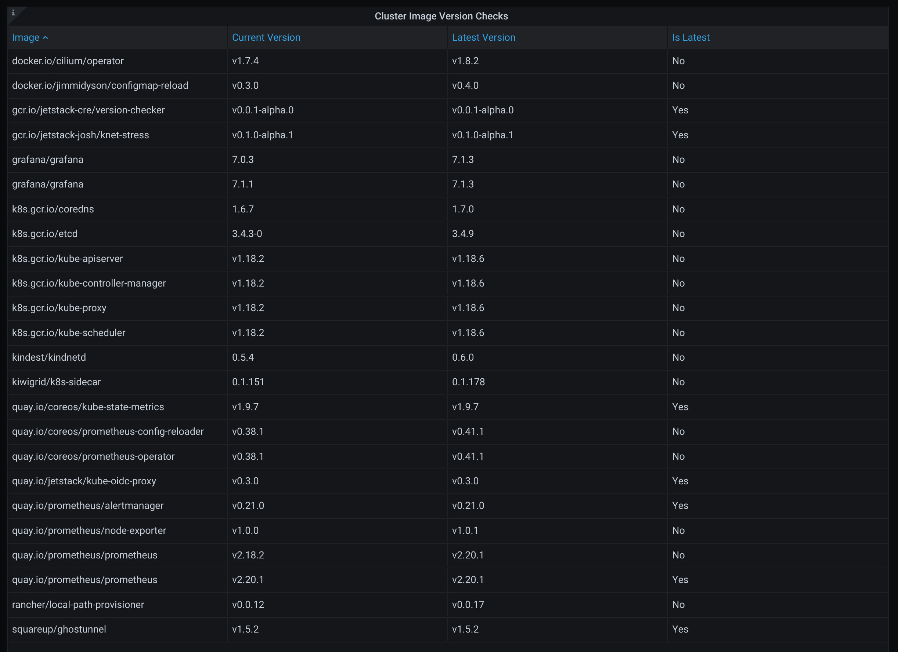

# version-checker

version-checker is a Kubernetes utility for observing the current versions of
images in use in the cluster, as well as the latest available upstream. These
checks get exposed as Prometheus metrics to be viewed on a dashboard, or _soft_
alert cluster operators.


## Registries

version-checker currently supports the following registries:

- docker (docker hub etc.)
- gcr (inc gcr facades such as k8s.gcr.io)
- quay

These registries support authentication.

---

## Installation

vesion-checker can be installed as either static manifests;

```sh
$ cd ./deploy/yaml && kubectl apply -f .
```

Or through helm;

```sh
$ cd ./deploy/charts/version-checker && kubectl create namespace verison-checker
$ helm install version-checker . -n version-checker
```

The helm chart supports creating a Prometheus/ServiceMonitor to expose the
version-checker metrics.

#### Grafana Dashboard

A [grafana dashboard](https://grafana.com/grafana/dashboards/12833) is also
available to view the image versions as a table.


<center></center>
<p align="center">
  <b>Grafana Dashboard</b><br>
</p>

---

## Options

By default without the flag `-a, --test-all-containers`, version-checker will
only test containers where the pod has the annotation
`enable.version-checker.io/*my-container*`, where `*my-continer*` is the `name`
of the container in the pod.

version-checker supports the following annotations present on **other** pods to
enrich version checking on image tags:

- `pin-major.version-checker.io/my-continer: 4`: will pin the major version to
    check to 4 (`v4.0.0`).

- `pin-minor.version-checker.io/my-continer: 3`: will pin the minor version to
    check to 3 (`v0.3.0`).

- `pin-patch.version-checker.io/my-continer: 23`: will pin the patch version to
    check to 23 (`v0.0.23`).

- `use-metadata.version-checker.io/my-container: "true"`: will allow to search
    for image tags which contain information after the first part of the semver
    string. For example, this can be pre-releases or build metadata
    (`v1.2.4-alpha.0`, `v1.2.3-debian-r3`).

- `use-sha.version-checker.io/my-container: "true"`: will check against the latest
    SHA tag available. Essentially, the latest image by date. This is silently
    set to true if no image tag, or "latest" image tag is set. Cannot be used with
    any other options.

- `match-regex.version-checker.io/my-container: $v\d+\.\d+\.\d+-debian\.*`: is
    used for only comparing against image tags which match the regex set. For
    example, the above annotation will only check against image tags which have
    the form of something like `v.1.3.4-debian-r30`.
    `use-metadata.version-checker.io` is not required when this is set. All
    other options are ignored when this is set.

## Metrics

By default, version-checker will expose the version information as Prometheus
metrics on `0.0.0.0:8080/metrics`.

## Future Development

- Support self hosted repositories.
- Image URL overwrites (to service registries which are mirroring images).
- Support more registry APIs.
